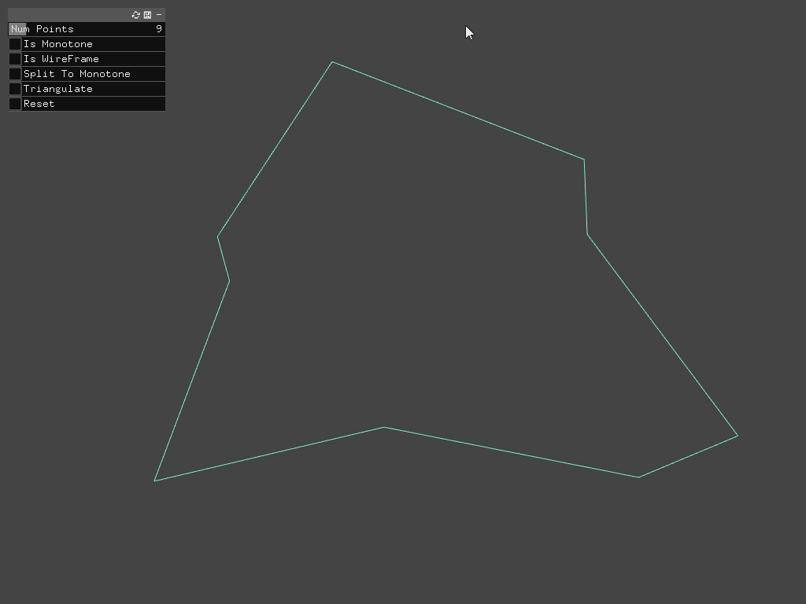

# ofxPolygonTriangulation

This an OpenFrameworks addon for Computational Geometry. At present it features a Doubly Connected Edge List and Polygon Triangulation. It is mainly based on the book [Computational Geometry Algorithms and Applications](https://link.springer.com/book/10.1007/978-3-540-77974-2). The addon comes with an example, unit tests, and doxygen generated documentation.

We developed the addon with OpenFrameworks 0.12.0, however we expect easy compatibility with other versions as dependencies are very limited and we essentially lean on basic standard library features. We generally stick to OpenFrameworks conventions.

## Example

The example allows users to:

* Select the number of points for a procedurally generated polygon.
* Whether or not that polygon is monotone.
* Whether or not it is displayed as wireframe.
* Splitting the polygon to monotone polygons.
* Fully triangulating the polygon.



## Usage

Triangulating a polygon is done as follows:

```
// The polygon as a vector of vec2 or vec3 points.
// These are expected to be in counter clockwise order,
// if not, an error will be thrown.
vector<glm::vec3> m_Polygon;

// The doubly connected edge list.
ofDoublyConnectedEdgeList m_Dcel;

// The triangulation class.
ofPolygonTriangulation m_Triangulation;

// A mesh to write the triangulation to.
ofMesh m_Mesh;

// Vectors holding the geometry vertices and indices.
vector<glm::vec3> m_Vertices;
vector<ofIndexType> m_Indices;

// Initialize the doubly connected edge list based on the polygon.
m_Dcel.initializeFromCCWVertices(m_Vertices);

// Triangulate the doubly connected edge list.
m_Triangulation.execute(m_Dcel);

// Write the calculated triangulation to the geometry buffers.
m_Dcel.extractTriangles(m_Vertices, m_Indices);

// Update the mesh geometry.
m_Mesh.clear();
m_Mesh.addVertices(m_Vertices);
m_Mesh.addIndices(m_Indices);
```

It is possible to work with the inner steps of polygon triangulation directly. Namely, splitting a polygon to monotone polygons and triangulating a monotone polygon. This is expected to be a niche usage and we refer to the documentation as well as tests and example code for these usages.

## Design

The core component is the doubly connected edge list, `ofDoublyConnectedEdgeList`. We store all data in collections of properties of vertices, half edges and faces. This avoids allocating each element independently, and allows us to connect these elements using indices rather than pointers. The goal is to have a straightforward data oriented design, making it easy to reason about memory layout. The Doubly Connected Edge List can then trivially be copied for example. We can also add properties to elements without slowing down other parts of the code as the corresponding memory is only accessed when needed. For code readability and to provide an easy to work with API, we introduce a concept of handles to elements.

For example, a vertex' properties are stored in collections of positions, chains, and incident half edges. It is manipulated using its handle, `Vertex`, so that we can write `vertex.getIncidentEdge().getIncidentFace()`. The handle only stores a pointer to the doubly connected edge list and the index of its data in the collections it belongs to. Internally, the handle manipulates the collections:

```
dcel::HalfEdge dcel::Vertex::getIncidentEdge() const {
	return dcel::HalfEdge(m_Dcel, m_Dcel->m_VerticesIncidentEdge[m_Index]);
}
```

We need to circulate over the doubly connected edge list, for example, iterating over the half edges of a face, or over the faces adjacent to a vertex. We implemented iterators for these scenarios, such as `FacesOnVertexIterator`. These aren't full fledged iterators as C++ understands them. Such an implementation would have been needlessly convoluted. Rather we use a very simple interface:

```
auto it = dcel::FacesOnVertexIterator(vertex);
do {
	// Access the current element.
	it.getCurrent();
} while (it.moveNext()); // Move to the next element, if any.
```

Triangulation is mainly implemented in 3 classes, reflecting the overall algorithm: `ofSplitToMonotone`, `ofTriangulateMonotone`, and `ofPolygonTriangulation` encapsulating them. These classes, responsible for operating on the doubly connected edge list, typically expose an `execute` method, and do not store a reference to the doubly connected edge list. However they manage required internal data structures and it's more efficient to keep instances of those for reuse rather than instantiate and destroy them whenever triangulation must be computed.

Note that at the moment the Doubly Connected Edge List does not handle holes in the represented polygon.
